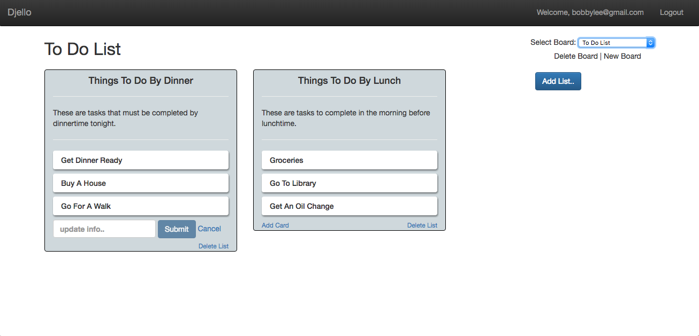

# Djello

Check it out [here!](https://mikedjello.herokuapp.com)

## Overview

Djello is a project management app that allows the user to keep track of everything in organized boards and keep tasks agile.

### Features

Users can:
* Create boards with specified lists
* Update lists with task-oriented cards
* Add members to cards to handle task responsibility
* Keep track of recent activity

## Developer

Created by [Mike Lee](https://github.com/asackofwheat)
